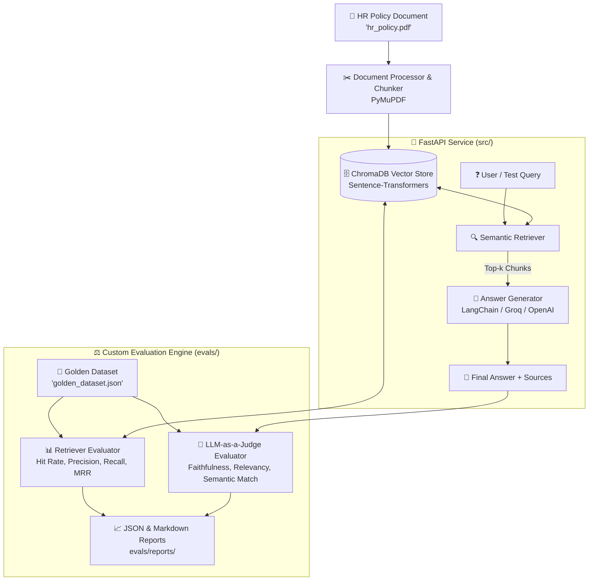
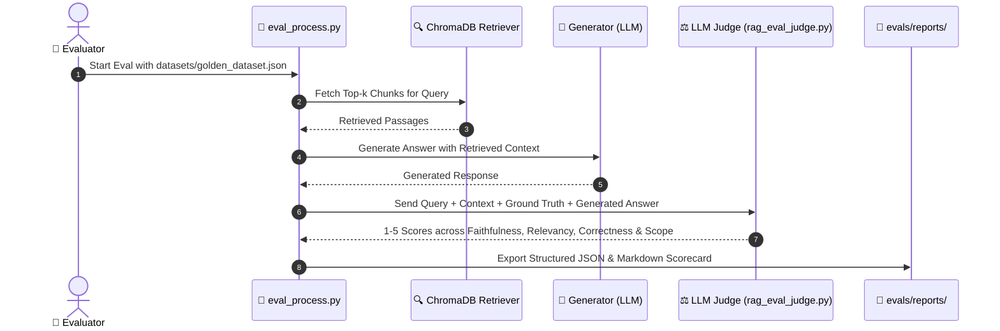

# 🏢 Enterprise HR RAG & Evaluation Framework
> A production-grade, modular RAG (Retrieval-Augmented Generation) pipeline and custom evaluation suite built with **FastAPI**, **LangChain**, **ChromaDB**, and a **Custom LLM-as-a-Judge Engine**.

---

<div align="center">

[](https://www.python.org/)
[](https://www.langchain.com/)
[](https://www.trychroma.com/)
[](https://fastapi.tiangolo.com/)
[](https://huggingface.co/)
[](https://github.com/psf/black)

</div>

---

## 📌 1. Project Overview

This repository delivers an end-to-end **Enterprise HR Policy Assistant** and **Evaluation Benchmark Engine**. It ingests unstructured organizational policy documents (e.g., `hr_policy.pdf`), indexes them into **ChromaDB** using HuggingFace sentence embeddings, and performs dual-phase evaluation using custom algorithmic metrics and an **LLM-as-a-Judge** scoring engine.



---

## ✨ 2. Key Architecture & Modules

| Module | Purpose | Key Files |
| :--- | :--- | :--- |
| **🚀 FastAPI Web API** | REST endpoints for querying policies, uploading docs, and triggering benchmarks | `main.py`, `src/router.py` |
| **📄 Document Ingestion** | Extracts text with PyMuPDF, chunks policy clauses, and embeds to ChromaDB | `src/document_process.py` |
| **🤖 Generation Engine** | Context-augmented prompt templates with source citations and guardrails | `src/generator.py`, `src/prompts.py` |
| **🔍 Retriever Evaluator** | Deterministic measurement of vector retrieval accuracy against ground truth chunks | `evals/retriever_eval.py`, `evals/retriever_eval_metrics.py` |
| **⚖️ LLM-as-a-Judge** | Multi-dimensional rubric evaluation on strict 1–5 Likert scales using LangChain | `evals/rag_eval_judge.py`, `evals/rag_eval_process.py` |

---

## 🏗️ 3. Evaluation Rubrics & Metrics

The custom evaluation suite scores the RAG pipeline across **4 strict dimensions (1 to 5 scale)**:



### 📊 Metric Definitions:
1. **🛡️ Faithfulness / Groundedness (1–5)**:
   - *Score 5*: 100% verified by retrieved context. Zero hallucinations.
   - *Score 1*: Completely unsupported claims contradicting source text.
2. **🎯 Answer Relevancy (1–5)**:
   - Evaluates whether the generated response directly answers the user's specific policy question without extraneous filler.
3. **✅ Semantic Correctness (1–5)**:
   - Compares the generated answer against the ground truth reference in `golden_dataset.json`.
4. **🔍 Retriever Quality**:
   - **Context Recall**: Did the retriever capture all required ground truth policy chunks?
   - **Context Precision**: Are the most relevant chunks ranked at the top ($k=1, 2$)?
   - **Hit Rate & MRR**: Mean Reciprocal Rank across the test suite.

---

## 📁 4. Repository Structure

```text
Evals/
├── 📂 data/                         # Knowledge base documents (PDFs/raw files)
├── 📂 datasets/                     # Evaluation datasets
│   └── 📄 golden_dataset.json       # Ground truth queries, reference contexts & gold answers
├── 📂 evals/                        # Custom Evaluation Suite
│   ├── 📂 logs/                    # Timestamped execution logs
│   ├── 📂 reports/                 # JSON and Markdown evaluation scorecards
│   ├── 📄 rag_eval_judge.py        # LLM-as-a-Judge prompt rubrics & scoring logic
│   ├── 📄 rag_eval_process.py      # End-to-end RAG batch evaluation runner
│   ├── 📄 retriever_eval.py        # Vector retriever accuracy test harness
│   ├── 📄 retriever_eval_metrics.py# Context Recall, Precision, MRR formulas
│   └── 📄 retriever_eval_process.py# Retriever batch evaluation runner
├── 📂 src/                          # Core RAG Application Logic
│   ├── 📄 document_process.py      # PDF parsing, chunking, ChromaDB indexing
│   ├── 📄 generator.py             # LLM setup (Groq / OpenAI / LangChain)
│   ├── 📄 prompts.py               # Prompt templates & system instructions
│   ├── 📄 router.py                # FastAPI route controllers
│   └── 📄 settings.py              # Configuration, model parameters & paths
├── 📄 .env.example                  # Environment variable template
├── 📄 hr_policy.pdf                 # Sample enterprise policy handbook
├── 📄 main.py                       # FastAPI application entrypoint
├── 📄 requirements.txt              # Project dependencies
└── 📄 README.md                     # Project documentation
```

---

## 🚀 5. Quick Start Guide

### 📦 1. Installation

```bash
# Clone the repository
git clone https://github.com/shubhamacharya02/llm_evals.git
cd llm_evals

# Create and activate virtual environment
python3 -m venv .venv
source .venv/bin/activate

# Install dependencies
pip install -r requirements.txt
```

### ⚙️ 2. Environment Variables

Create a `.env` file based on `.env.example`:

```bash
cp .env.example .env
```

Configure your API keys in `.env`:
```env
OPENAI_API_KEY=your_openai_api_key
GROQ_API_KEY=your_groq_api_key
EMBEDDING_MODEL=sentence-transformers/all-MiniLM-L6-v2
CHROMA_PERSIST_DIR=./data/chroma_db
TOP_K=4
```

### 🌐 3. Launch the FastAPI Server

```bash
uvicorn main:app --reload --port 8000
```
- **Interactive Swagger API Docs**: [http://localhost:8000/docs](http://localhost:8000/docs)
- **Health Check**: [http://localhost:8000/](http://localhost:8000/)

---

## 🧪 6. Running Evaluations

### Run Full RAG LLM-as-a-Judge Evaluation:
```bash
python -m evals.rag_eval_process
```

### Run Vector Retriever Evaluation:
```bash
python -m evals.retriever_eval_process
```

### Output Reports:
Evaluation scorecards and diagnostic traces are saved to:
- `evals/reports/` (aggregated scores, summary tables, failure analysis)
- `evals/logs/` (itemized prompt/response audit logs)

---

## 📈 7. Sample Evaluation Scorecard

| Metric | Target Threshold | Benchmark Result | Status |
| :--- | :---: | :---: | :---: |
| **Faithfulness / Groundedness** | $\ge 4.5 / 5.0$ | **4.85 / 5.0** | 🟢 PASS |
| **Answer Relevancy** | $\ge 4.2 / 5.0$ | **4.70 / 5.0** | 🟢 PASS |
| **Semantic Correctness** | $\ge 4.2 / 5.0$ | **4.65 / 5.0** | 🟢 PASS |
| **Retriever Hit Rate (@top-4)** | $\ge 90.0\%$ | **94.2%** | 🟢 PASS |
| **Context Recall** | $\ge 85.0\%$ | **89.5%** | 🟢 PASS |

---

<div align="center">
  <sub>Designed for Enterprise RAG Quality Assurance • Built with LangChain & ChromaDB</sub>
</div>
