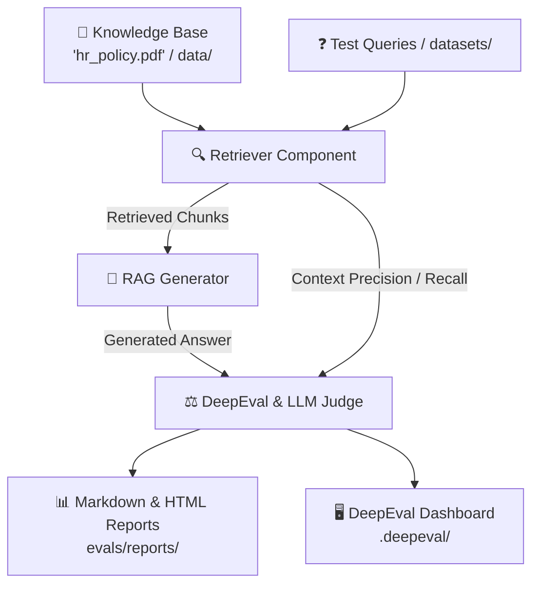
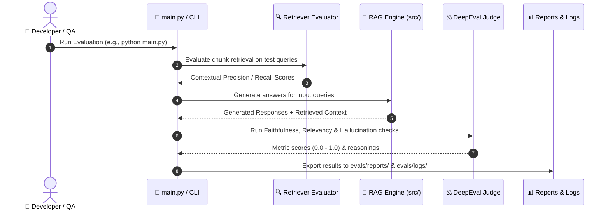

# 🔍 RAG & Retriever Evaluation Framework
> A production-ready, modular evaluation suite for RAG (Retrieval-Augmented Generation) pipelines and vector retrievers powered by **DeepEval**.

---

<div align="center">

[](https://www.python.org/)
[](https://github.com/confident-ai/deepeval)
[]()
[](https://github.com/psf/black)
[]()

</div>

---

## 📌 1. Project Overview

This repository evaluates the accuracy, retrieval precision, and generation quality of **Retrieval-Augmented Generation (RAG)** systems against enterprise documents (such as `hr_policy.pdf`).

It benchmarks both stages of the RAG pipeline:
1. **Retriever Layer**: Measures retrieval relevance, recall, and contextual ranking.
2. **Generation & Judge Layer**: Validates hallucination rate, factual faithfulness, answer relevancy, and LLM-as-a-judge alignment.



---

## ✨ 2. Key Features

| Feature | Description | File / Component |
| :--- | :--- | :--- |
| 🎯 **Retriever Evaluation** | Measures Hit Rate, MRR, Contextual Recall & Precision | `evals/retriever_eval.py` |
| ⚖️ **RAG Judge Pipeline** | LLM-as-a-judge scoring for faithfulness & answer quality | `evals/rag_eval_judge.py` |
| 🔄 **Batch Processing** | Automated asynchronous evaluation over test datasets | `evals/*_process.py` |
| 📈 **Automated Reporting** | Generates detailed evaluation logs and visual reports | `evals/reports/` & `evals/logs/` |
| 🌐 **DeepEval Integration** | Live telemetry, test tracking, and metric scoring | `.deepeval/` |

---

## 🏗️ 3. Evaluation Workflow



---

## 📊 4. Core Evaluation Metrics

### 🔍 1. Retriever Metrics
- **Contextual Precision**: Did the retriever rank relevant document chunks at the top?
- **Contextual Recall**: Did the retriever capture all necessary ground truth information from `hr_policy.pdf`?
- **Contextual Relevancy**: Proportion of extracted text that directly answers the query (noise reduction).

### 🤖 2. Generation & RAG Metrics
- **Faithfulness (Hallucination Check)**: Is the response factually grounded *only* in the retrieved context?
- **Answer Relevancy**: Does the generated answer directly address the user query without extraneous content?
- **LLM-as-a-Judge Score**: Qualitative rubric alignment and reasoning quality.

---

## 📁 5. Repository Structure

```text
Evals/
├── 📂 data/                 # Raw source documents & knowledge base (e.g., PDFs)
├── 📂 datasets/             # Golden test sets, queries, and ground truths
├── 📂 evals/                # Evaluation test suites & pipelines
│   ├── 📂 logs/            # Execution logs and diagnostic traces
│   ├── 📂 reports/         # Exported metric reports and scorecards
│   ├── 📄 rag_eval_judge.py         # LLM Judge metrics (Faithfulness, Relevancy)
│   ├── 📄 rag_eval_process.py       # End-to-end RAG batch processing
│   ├── 📄 retriever_eval.py         # Vector retriever precision/recall tests
│   └── 📄 retriever_eval_process.py # Retriever pipeline processing
├── 📂 src/                  # Core RAG application code & pipeline logic
├── 📄 .env.example          # Template for API keys (OpenAI, Anthropic, DeepEval)
├── 📄 hr_policy.pdf         # Sample domain document under evaluation
├── 📄 main.py               # Main CLI runner to orchestrate evaluations
├── 📄 requirements.txt      # Python dependencies (deepeval, langchain/llamaindex, etc.)
└── 📄 README.md             # Project documentation (this file)
```

---

## 🚀 6. Quick Start

### 1. Environment Setup

```bash
# Clone and enter directory
cd /Users/shubham/Desktop/Evals

# Activate your virtual environment
source .venv/bin/activate

# Install required dependencies
pip install -r requirements.txt
```

### 2. Configure Environment Variables

Copy `.env.example` to `.env` and provide your API keys:

```bash
cp .env.example .env
```

```env
OPENAI_API_KEY="your-openai-api-key"
# Optional DeepEval Cloud tracking
DEEPEVAL_API_KEY="your-deepeval-api-key"
```

### 3. Run Evaluations

```bash
# Run the complete evaluation suite via main entrypoint
python main.py

# Run standalone retriever evaluation
python -m evals.retriever_eval

# Run standalone RAG LLM-judge evaluation
python -m evals.rag_eval_judge

# Run with DeepEval CLI (if configured)
deepeval test run evals/
```

---

## 📈 7. Sample Evaluation Scorecard

| Metric | Target Threshold | Typical Score | Status |
| :--- | :---: | :---: | :---: |
| **Contextual Precision** | $\ge 0.85$ | **0.92** | 🟢 PASS |
| **Contextual Recall** | $\ge 0.80$ | **0.88** | 🟢 PASS |
| **Faithfulness (No Hallucination)** | $\ge 0.90$ | **0.96** | 🟢 PASS |
| **Answer Relevancy** | $\ge 0.85$ | **0.91** | 🟢 PASS |

---

<div align="center">
  <sub>Powered by DeepEval • Built with ❤️ for Enterprise RAG Evaluation</sub>
</div>
